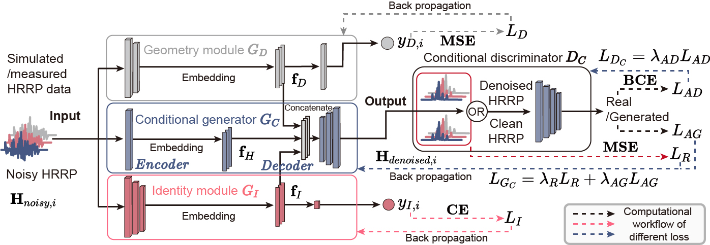

# Feature Fusion CGAN Based HRRP Denoising and Reconstruction, CJE_2025

<div align="right">
  <a href="#english">English</a> | <a href="#chinese">中文</a>
</div>

---

<a name="english"></a>
## English

This repository provides a comprehensive deep learning framework for High-Resolution Range Profile (HRRP) signal denoising, supporting multiple models and PSNR-controlled training and testing.

> This paper addresses the issue of High Resolution Range Profile (HRRP) data-based Radar Automatic Target Recognition (RATR) under noise interference by proposing a denoising and reconstruction method based on a feature fusion Conditional Generative Adversarial Network (CGAN). Compared with current methods based on Auto-Encoder (AE) models that only achieves local precision, the proposed CGAN effectively learns the global distribution of HRRP data through the adversarial training of a generator structured as an encoder-decoder and a discriminator composed by a Multilayer Perceptron (MLP). Additionally, to realize precise HRRP denoising and reconstruction, inspired by the application of radial length for rough target classification, we introduce two simple but innovative modules that designed to extract high-dimensional representations of geometry information and identity information, which is finally fused with high-dimensional representation of HRRP extracted by the encoder and serves as the decoder's input. In our experiments, we employs a One Dimensional Convolutional Neural Network (1-D CNN) to classify the denoised and reconstructed HRRPs and evaluate the effectiveness of the proposed method. Results prove that in the conditions of Peak Signal-to-Noise Ratio (PSNR) 20dB, 10dB and 5dB, the improvement of recognition accuracy, PSNR, and Structural Similarity (SSIM) surpass other methods on both simulated and measured datasets.

<p align="center">
  
</p>

---

### Platform :pushpin:

Developed and tested on PyCharm IDE with Conda environment. Recommended OS:
- Ubuntu 20.04+ 
- Windows 10/11 (WSL2 recommended)

---

### Dependencies :wrench:

```bash
conda create -n hrrp_denoising python=3.8
conda activate hrrp_denoising
pip install torch==2.2.0 torchvision==0.17.0
pip install numpy matplotlib scikit-image pandas seaborn
```

---

### Dataset Structure :file_folder:

Prepare your data with following structure:
```bash
datasets/
├── simulated_3/
│   ├── train/
│   └── test/
└── measured_3/
    ├── train/
    └── test/
```

---

### Quick Start :rocket:

#### Training Models

Use the unified training script `train_all.py` to train any model:

```bash
# Train CGAN model at multiple PSNR levels
python train_all.py --model cgan --psnr_levels 20 10 0 --train_dir datasets/simulated_3/train --save_dir checkpoints --batch_size 64 --epochs 200 --save_samples

# Train CAE model at specific PSNR level
python train_all.py --model cae --psnr_levels 10 --train_dir datasets/simulated_3/train --save_dir checkpoints --batch_size 64 --epochs 200

# Train feature extractor modules first (required for CGAN)
python train_all.py --model modules --train_dir datasets/simulated_3/train --save_dir checkpoints/modules --batch_size 256 --epochs 1000

# Train all models at once
python train_all.py --model all --psnr_levels 20 10 0 --train_dir datasets/simulated_3/train --save_dir checkpoints --batch_size 64 --epochs 200
```

#### Testing and Comparing Models

Use the unified testing script `test_all.py` to evaluate and compare models:

```bash
# Test CGAN model
python test_all.py --model cgan --psnr_levels 20 10 0 --test_dir datasets/simulated_3/test --cgan_dir checkpoints/cgan --output_dir results --num_samples 10

# Compare all models
python test_all.py --model all --psnr_levels 20 10 0 --test_dir datasets/simulated_3/test --cgan_dir checkpoints/cgan --cae_dir checkpoints/cae --ae_dir checkpoints/ae --output_dir results/comparison --num_samples 10

# Create detailed visualizations
python test_all.py --model all --psnr_levels 10 --test_dir datasets/simulated_3/test --cgan_dir checkpoints/cgan --cae_dir checkpoints/cae --ae_dir checkpoints/ae --output_dir results/visualization --num_samples 5 --num_vis_samples 5
```

---

<a name="chinese"></a>
## 中文

本仓库提供了一个全面的深度学习框架，用于高分辨距离像（HRRP）信号去噪，支持多种模型以及基于PSNR控制的训练和测试。

> 本文针对噪声干扰下基于高分辨距离像（HRRP）数据的雷达自动目标识别（RATR）问题，提出了一种基于特征融合条件生成对抗网络（CGAN）的去噪与重建方法。与当前仅能实现局部精度的基于自编码器（AE）模型的方法相比，所提出的CGAN通过编码器-解码器结构的生成器和多层感知机（MLP）组成的判别器的对抗训练，有效学习HRRP数据的全局分布。此外，为了实现精确的HRRP去噪与重建，受径向长度用于粗略目标分类应用的启发，我们引入了两个简单但创新的模块，旨在提取几何信息和身份信息的高维表示，最终与编码器提取的HRRP高维表示融合，作为解码器的输入。在实验中，我们采用一维卷积神经网络（1-D CNN）对去噪和重建后的HRRP进行分类，评估所提方法的有效性。结果证明，在峰值信噪比（PSNR）20dB、10dB和5dB条件下，在仿真和实测数据集上，识别准确率、PSNR和结构相似性（SSIM）的提升均优于其他方法。

<p align="center">
  
</p>

---

### 平台 :pushpin:

在 PyCharm IDE 和 Conda 环境中开发和测试。推荐的操作系统：
- Ubuntu 20.04+ 
- Windows 10/11（推荐使用 WSL2）

---

### 依赖 :wrench:

```bash
conda create -n hrrp_denoising python=3.8
conda activate hrrp_denoising
pip install torch==2.2.0 torchvision==0.17.0
pip install numpy matplotlib scikit-image pandas seaborn
```

---

### 数据集结构 :file_folder:

按以下结构准备您的数据：
```bash
datasets/
├── simulated_3/
│   ├── train/
│   └── test/
└── measured_3/
    ├── train/
    └── test/
```

---

### 快速开始 :rocket:

#### 训练模型

使用统一的训练脚本 `train_all.py` 来训练任意模型：

```bash
# 在多个PSNR水平上训练CGAN模型
python train_all.py --model cgan --psnr_levels 20 10 0 --train_dir datasets/simulated_3/train --save_dir checkpoints --batch_size 64 --epochs 200 --save_samples

# 在特定PSNR水平上训练CAE模型
python train_all.py --model cae --psnr_levels 10 --train_dir datasets/simulated_3/train --save_dir checkpoints --batch_size 64 --epochs 200

# 首先训练特征提取模块（CGAN所需）
python train_all.py --model modules --train_dir datasets/simulated_3/train --save_dir checkpoints/modules --batch_size 256 --epochs 1000

# 一次性训练所有模型
python train_all.py --model all --psnr_levels 20 10 0 --train_dir datasets/simulated_3/train --save_dir checkpoints --batch_size 64 --epochs 200
```

#### 测试和比较模型

使用统一的测试脚本 `test_all.py` 来评估和比较模型：

```bash
# 测试CGAN模型
python test_all.py --model cgan --psnr_levels 20 10 0 --test_dir datasets/simulated_3/test --cgan_dir checkpoints/cgan --output_dir results --num_samples 10

# 比较所有模型
python test_all.py --model all --psnr_levels 20 10 0 --test_dir datasets/simulated_3/test --cgan_dir checkpoints/cgan --cae_dir checkpoints/cae --ae_dir checkpoints/ae --output_dir results/comparison --num_samples 10

# 创建详细可视化
python test_all.py --model all --psnr_levels 10 --test_dir datasets/simulated_3/test --cgan_dir checkpoints/cgan --cae_dir checkpoints/cae --ae_dir checkpoints/ae --output_dir results/visualization --num_samples 5 --num_vis_samples 5
```

---

## Citation / 引用

If you find our work useful in your research, please consider citing:

如果您在研究中觉得我们的工作有用，请考虑引用：

```bibtex
@Article{E250022,
title = {Feature Fusion CGAN Based HRRP Denoising and Reconstruction Method},
journal = {Chinese Journal of Electronics},
volume = {35},
number = {1},
pages = {243-256},
year = {2026},
issn = {},
doi = {10.23919/cje.2025.00.022},
url = {https://cje.ejournal.org.cn/en/article/doi/10.23919/cje.2025.00.022},
author = {Hu Panhe and Chen Lingfeng and Zhang Zhiyuan and Liu Zhen}
}
```

---

## License / 许可证 :page_facing_up:

This project is licensed under the MIT License - see the [LICENSE](LICENSE) file for details.

本项目基于 MIT 许可证发布 - 详情请参见 [LICENSE](LICENSE) 文件。
